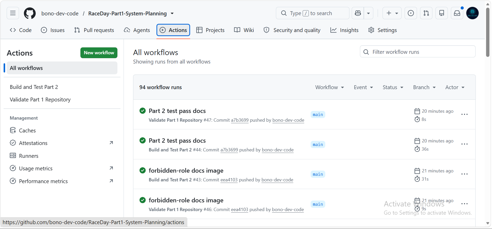
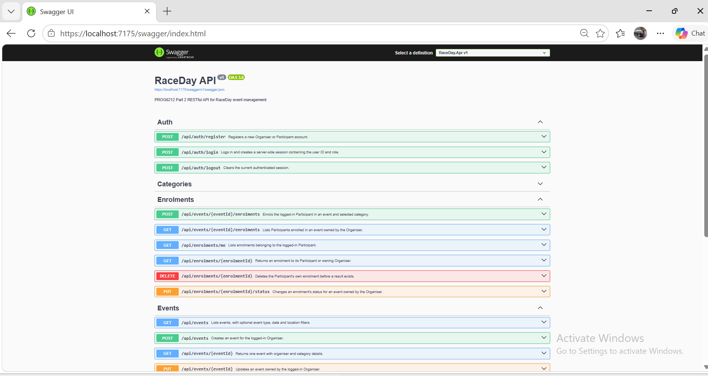
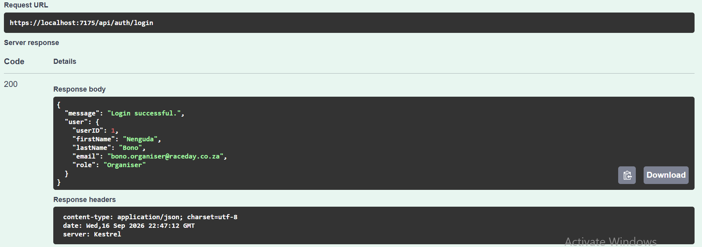
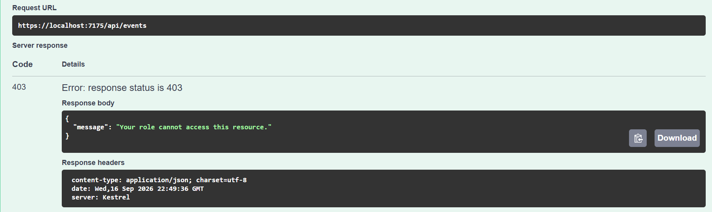
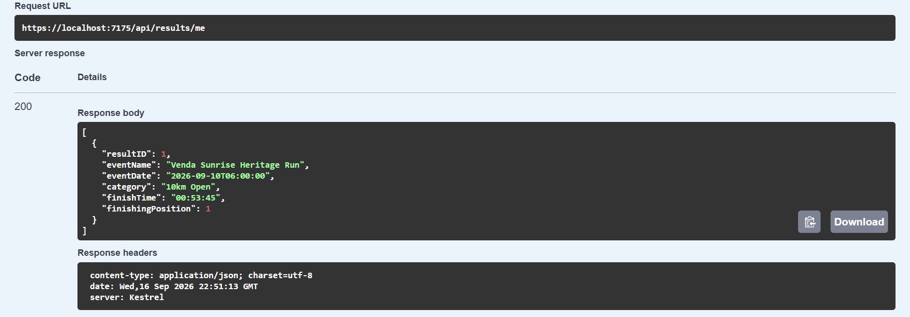
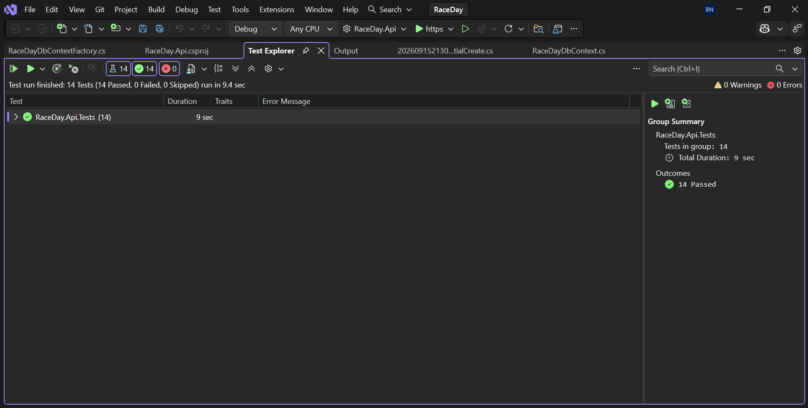

# RaceDay

RaceDay is a South African event-management system for road-running, walking and cycling events. Part 1 documents the system planning, database design, API structure and SQL Server schema. Part 2 implements that design as a functional ASP.NET Core RESTful Web API.

## Student details

- Name: Bono Nenguda
- Student Number: ST10484954
- Module: Programming 2B
- Module code: PROG6212
- Assessment: Portfolio of Evidence - Parts 1 and 2

## User roles

### Organiser

An Organiser can create and manage events, define event categories, view enrolments, update enrolment statuses and capture participant results.

### Participant

A Participant can register and log in, manage a profile, browse events, select a category, enrol in an event and view race-result history.

## Part 1 deliverables

| Deliverable | File |
|---|---|
| Entity Relationship Diagram | [`docs/RaceDay_Part1_ERD.pdf`](docs/RaceDay_Part1_ERD.pdf) |
| API Endpoint Plan | [`docs/RaceDay_API_Endpoint_Plan.pdf`](docs/RaceDay_API_Endpoint_Plan.pdf) |
| SQL Database Script | [`docs/RaceDay_Database.sql`](docs/RaceDay_Database.sql) |

## Database design

The RaceDay database contains six related entities:

1. `Role` stores the Organiser and Participant roles.
2. `User` stores registered RaceDay users.
3. `Event` stores running, walking and cycling events.
4. `Category` stores the age or distance categories for each event.
5. `Enrolment` connects a Participant to an Event and selected Category.
6. `Result` stores the finish time and finishing position for an enrolment.

`Enrolment` resolves the many-to-many relationship between Participants and Events. A unique constraint prevents a Participant from enrolling in the same Event more than once. A Result is linked to one Enrolment, and its foreign key is unique so that an enrolment cannot receive more than one final result.

## API endpoint plan

The endpoint plan covers the following areas:

- Authentication: registration and login
- User profile management
- Event management
- Category management
- Event enrolments
- Results and participant race history

Every planned endpoint specifies its HTTP method, route, purpose, required role, request body and expected success or failure responses.

## SQL Server setup

### Requirements

- Microsoft SQL Server
- SQL Server Management Studio (SSMS)

### Running the database script

1. Open SQL Server Management Studio.
2. Connect to a SQL Server instance.
3. Open `docs/RaceDay_Database.sql`.
4. Execute the script from the top, or run each section from one `GO` separator to the next.
5. Refresh the Databases folder in Object Explorer.
6. Confirm that `RaceDayDB` and its six tables were created.
7. Check the final two result grids to confirm the seeded record counts and enrolment details.

The script creates the database when it does not exist, creates all tables and constraints, inserts realistic sample data, and finishes with verification queries.

## Part 1 repository structure

```text
RaceDay-Part1-System-Planning/
├── .github/
│   └── workflows/
│       └── validate-part1.yml
├── docs/
│   ├── RaceDay_API_Endpoint_Plan.pdf
│   ├── RaceDay_Database.sql
│   └── RaceDay_Part1_ERD.pdf
├── .gitignore
└── README.md
```

## Continuous integration

The GitHub Actions workflow runs on every push and pull request. It confirms that:

- `README.md` exists.
- The `/docs` folder exists.
- All three required Part 1 deliverables exist and are not empty.
- Both submitted documents are valid PDF files.
- The SQL script contains the six required `CREATE TABLE` statements.
- The SQL script includes primary keys, foreign keys, unique constraints, default constraints and seed-data statements.

### Successful workflow

The GitHub Actions workflow successfully validates the Part 1 repository structure, required documents and SQL database script.


## Video Presentation

The Part 1 video presentation explains the RaceDay ERD design decisions, API endpoint plan, SQL Server database design, and the successful live execution of the complete database script in SQL Server Management Studio.

[Watch the RaceDay Part 1 Video Presentation](https://youtu.be/tMmNPZpLblY)

## Part 1 conclusion

RaceDay Part 1 provides the system-planning foundation for a South African running, walking and cycling event-management platform. The ERD, API endpoint plan and SQL Server database script were designed consistently to support users, events, categories, enrolments and results.

This project was developed for educational and academic assessment purposes as part of the PROG6212 Portfolio of Evidence.

---

# Part 2: RESTful Web API Implementation

Part 2 develops the system planned in Part 1 into a functional controller-based ASP.NET Core Web API. The implementation follows the approved database design and endpoint plan while adding authentication, role-based access control, Entity Framework Core persistence, Swagger documentation, automated integration tests and continuous integration.

## Part 2 features

- Organiser and Participant registration
- BCrypt password hashing
- Server-side session login and logout
- Role-based endpoint protection
- User profile viewing and editing
- Event and category management
- Participant event enrolment
- Organiser enrolment-status management
- Race-result capture and participant result history
- Swagger/OpenAPI documentation
- Entity Framework Core Code-First migrations
- SQL Server LocalDB persistence
- xUnit integration tests
- GitHub Actions continuous integration

## Part 2 technology stack

- .NET 8
- ASP.NET Core Web API
- Entity Framework Core 8
- SQL Server LocalDB
- BCrypt.Net
- Swagger and Swashbuckle
- xUnit
- `WebApplicationFactory`
- EF Core InMemory provider for integration tests
- GitHub Actions

## Complete repository structure

```text
RaceDay-Part1-System-Planning/
├── .github/
│   └── workflows/
│       ├── validate-part1.yml
│       └── validate-part2.yml
├── docs/                              # Part 1 evidence
│   ├── RaceDay_API_Endpoint_Plan.pdf
│   ├── RaceDay_Database.sql
│   ├── RaceDay_Part1_ERD.pdf
│   └── ci-success.png
├── part2/
│   ├── RaceDay.Api/
│   │   ├── Controllers/               # API endpoints
│   │   ├── Data/                      # DbContext and context factory
│   │   ├── Dtos/                      # Validated request models
│   │   ├── Filters/                   # Session and role authorization
│   │   ├── Migrations/                # EF Core migration files
│   │   ├── Models/                    # Database entities
│   │   ├── Properties/                # Launch profile
│   │   ├── Program.cs
│   │   ├── appsettings.json
│   │   └── RaceDay.Api.csproj
│   ├── RaceDay.Api.Tests/
│   │   ├── ApiIntegrationTests.cs
│   │   ├── CustomWebApplicationFactory.cs
│   │   └── RaceDay.Api.Tests.csproj
│   └── docs/
│       └── Screenshots/               # Part 2 evidence
├── RaceDay.sln
├── .gitignore
└── README.md
```

## Part 2 database implementation

Entity Framework Core maps the six entities designed in Part 1: `Role`, `User`, `Event`, `Category`, `Enrolment` and `Result`. The model configuration includes primary keys, foreign keys, unique indexes, default values, delete behaviours and check constraints.

The API uses `RaceDayDbPart2`, keeping the Part 2 Code-First database separate from the `RaceDayDB` used for Part 1 evidence. The migration seeds the two required roles: `Organiser` and `Participant`.

## Prerequisites

- Visual Studio 2022 with the **ASP.NET and web development** workload
- .NET 8 SDK
- SQL Server Express LocalDB
- SQL Server Management Studio 22, if database inspection is required
- Git

## Part 2 setup and run instructions

1. Clone the repository and enter its root folder:

```powershell
git clone https://github.com/bono-dev-code/RaceDay-Part1-System-Planning.git
cd RaceDay-Part1-System-Planning
```

2. Restore the Part 2 packages:

```powershell
dotnet restore part2/RaceDay.Api/RaceDay.Api.csproj
```

3. Confirm that `RaceDayConnection` in `part2/RaceDay.Api/appsettings.json` points to LocalDB:

```text
Server=(localdb)\MSSQLLocalDB;Database=RaceDayDbPart2;Trusted_Connection=True;TrustServerCertificate=True;MultipleActiveResultSets=true
```

4. Run the API from the repository root:

```powershell
dotnet run --project part2/RaceDay.Api/RaceDay.Api.csproj
```

5. Open Swagger UI:

```text
https://localhost:7175/swagger
```

At startup, the API automatically applies the available EF Core migration and creates or updates `RaceDayDbPart2`.

### Running with Visual Studio

1. Open `RaceDay.sln`.
2. Set `RaceDay.Api` as the startup project.
3. Select the `https` launch profile.
4. Run the project. Swagger opens automatically.

## Authentication and role-based access control

Registration accepts the `Organiser` or `Participant` role. Passwords are hashed with BCrypt before they are stored. After a successful login, the API stores the authenticated `UserID` and `Role` in a server-side session. The session cookie is named `.RaceDay.Session` and expires after 30 minutes of inactivity.

Swagger keeps the session cookie in the same browser session, allowing protected endpoints to be tested after login.

Protected endpoints return:

- `401 Unauthorized` when no authenticated session exists.
- `403 Forbidden` when the authenticated role is not allowed or the user does not own the requested resource.

### Role permissions

| Capability | Organiser | Participant |
|---|:---:|:---:|
| Register, log in and log out | Yes | Yes |
| View and update own profile | Yes | Yes |
| Browse events and categories | Yes | Yes |
| Create, update and delete owned events | Yes | No |
| Manage categories for owned events | Yes | No |
| Enrol in an event | No | Yes |
| View own enrolments | No | Yes |
| View enrolments for an owned event | Yes | No |
| Update enrolment status | Yes | No |
| Capture, update and delete results | Yes | No |
| View own result history | No | Yes |

## API endpoints

### Authentication endpoints

| Method | Route | Access | Purpose |
|---|---|---|---|
| `POST` | `/api/auth/register` | Public | Register an Organiser or Participant |
| `POST` | `/api/auth/login` | Public | Log in and create a server-side session |
| `POST` | `/api/auth/logout` | Public | Clear the current session |

### User endpoints

| Method | Route | Access | Purpose |
|---|---|---|---|
| `GET` | `/api/users/me` | Authenticated | View the current user's profile |
| `PUT` | `/api/users/me` | Authenticated | Update the current user's profile |

### Event endpoints

| Method | Route | Access | Purpose |
|---|---|---|---|
| `GET` | `/api/events` | Public | List events with optional filters |
| `GET` | `/api/events/{eventId}` | Public | View one event and its categories |
| `POST` | `/api/events` | Organiser | Create an event |
| `PUT` | `/api/events/{eventId}` | Organiser and owner | Update an owned event |
| `DELETE` | `/api/events/{eventId}` | Organiser and owner | Delete an owned event without enrolments |
| `GET` | `/api/organisers/me/events` | Organiser | List the current Organiser's events |

`GET /api/events` supports the optional `type`, `date` and `location` query parameters.

### Category endpoints

| Method | Route | Access | Purpose |
|---|---|---|---|
| `GET` | `/api/events/{eventId}/categories` | Public | List categories for an event |
| `GET` | `/api/categories/{categoryId}` | Public | View one category |
| `POST` | `/api/events/{eventId}/categories` | Organiser and owner | Add a category to an owned event |
| `PUT` | `/api/categories/{categoryId}` | Organiser and owner | Update an owned event's category |
| `DELETE` | `/api/categories/{categoryId}` | Organiser and owner | Delete an unused category |

### Enrolment endpoints

| Method | Route | Access | Purpose |
|---|---|---|---|
| `POST` | `/api/events/{eventId}/enrolments` | Participant | Enrol in an event and category |
| `GET` | `/api/enrolments/me` | Participant | List the current Participant's enrolments |
| `GET` | `/api/enrolments/{enrolmentId}` | Participant owner or Organiser event owner | View one enrolment |
| `GET` | `/api/events/{eventId}/enrolments` | Organiser and owner | List enrolments for an owned event |
| `PUT` | `/api/enrolments/{enrolmentId}/status` | Organiser and owner | Set `Pending`, `Confirmed` or `Cancelled` |
| `DELETE` | `/api/enrolments/{enrolmentId}` | Participant and owner | Delete an enrolment before a result exists |

### Result endpoints

| Method | Route | Access | Purpose |
|---|---|---|---|
| `GET` | `/api/events/{eventId}/results` | Public | List published results for an event |
| `GET` | `/api/results/me` | Participant | View the current Participant's result history |
| `GET` | `/api/results/{resultId}` | Participant owner or Organiser event owner | View one result |
| `POST` | `/api/enrolments/{enrolmentId}/result` | Organiser and owner | Capture a result for a confirmed enrolment |
| `PUT` | `/api/results/{resultId}` | Organiser and owner | Correct a result |
| `DELETE` | `/api/results/{resultId}` | Organiser and owner | Delete a result |

## Main API workflow

1. Register an Organiser and a Participant.
2. Log in as the Organiser.
3. Create an event.
4. Add an age or distance category to the event.
5. Log out and log in as the Participant.
6. Browse the event and enrol using the category ID.
7. Log out and log back in as the Organiser.
8. View the event enrolments and change the enrolment status to `Confirmed`.
9. Capture the Participant's finish time and finishing position.
10. Log in as the Participant and view the result history.

## Automated integration tests

Run the complete Part 2 test suite from the repository root:

```powershell
dotnet restore part2/RaceDay.Api.Tests/RaceDay.Api.Tests.csproj
dotnet build part2/RaceDay.Api.Tests/RaceDay.Api.Tests.csproj --configuration Release --no-restore
dotnet test part2/RaceDay.Api.Tests/RaceDay.Api.Tests.csproj --configuration Release --no-build
```

The project contains **14 integration tests** covering:

- Valid registration
- Duplicate-email rejection
- Invalid-login rejection
- Unauthenticated-access rejection
- Participant role restrictions
- Organiser event creation and retrieval
- Public event listing
- Organiser event updating and deletion
- Category creation
- Participant enrolment
- Duplicate-enrolment prevention
- Organiser endpoint authorization
- Swagger availability
- Session logout

The tests use `CustomWebApplicationFactory` and an isolated EF Core InMemory database. They do not change the SQL Server LocalDB database.

## Part 2 continuous integration

The `.github/workflows/validate-part2.yml` GitHub Actions workflow runs for relevant pushes and pull requests. It:

1. Confirms the required Part 2 repository structure.
2. Sets up .NET 8.
3. Restores the Part 2 dependencies.
4. Builds the API and test projects in Release mode.
5. Runs all automated integration tests.

### Successful Part 2 workflow



## Part 2 evidence screenshots

### Swagger overview



### Authentication success



### Role-based access control



### Main API workflow



### Automated tests



## Part 2 video demonstration

Add the unlisted YouTube video link before the final submission:

[Watch the RaceDay Part 2 Video Demonstration](PASTE-PART-2-YOUTUBE-LINK-HERE)

The video demonstration should show:

- The GitHub repository and Part 2 project structure
- The SQL Server database and six tables
- Swagger and the documented endpoints
- Registration, login and session authentication
- Organiser and Participant role permissions
- A `403 Forbidden` role-restriction example
- The complete event, category, enrolment and result workflow
- All 14 automated tests passing
- The successful Part 2 GitHub Actions run

## Part 2 conclusion

RaceDay Part 1 established the system-planning and database foundation, while Part 2 transformed that design into a functional RESTful Web API. The completed solution demonstrates database integration, secure password storage, session authentication, role-based authorization, CRUD operations, Swagger documentation, automated integration testing and continuous integration.

This project was developed for educational and academic assessment purposes as part of the PROG6212 Portfolio of Evidence. 