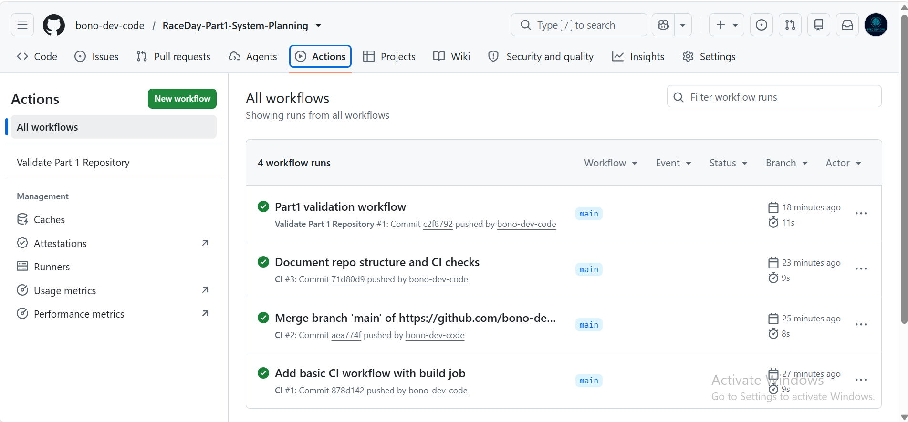

# RaceDay

RaceDay is a planned South African event-management system for road-running, walking and cycling events. Part 1 documents the database design, API structure and SQL Server schema that will guide the implementation in later parts of the POE.

## Student details

- Name: Bono Nenguda ST10484954
- Module: Programming 2B
- Module code: PROG6212
- Assessment: POE Part 1

## User roles

### Organiser

An Organiser can create and manage events, define event categories, view enrolments, update enrolment statuses and capture participant results.

### Participant

A Participant can register and log in, manage a profile, browse events, select a category, enrol in an event and view race-result history.

## Part 1 deliverables

| Deliverable | File |
|---|---|
| Entity Relationship Diagram | [`docs/RaceDay_Part1_ERD.pdf`](docs/RaceDay_Part1_ERD.pdf) |
| API Endpoint Plan | [`docs/RaceDay_API_Endpoint_Plan.pdf`](docs/RaceDay_API_Endpoint_Plan.pdf) |
| SQL Database Script | [`docs/RaceDay_Database.sql`](docs/RaceDay_Database.sql) |

## Database design

The RaceDay database contains six related entities:

1. `Role` stores the Organiser and Participant roles.
2. `User` stores registered RaceDay users.
3. `Event` stores running, walking and cycling events.
4. `Category` stores the age or distance categories for each event.
5. `Enrolment` connects a Participant to an Event and selected Category.
6. `Result` stores the finish time and finishing position for an enrolment.

`Enrolment` resolves the many-to-many relationship between Participants and Events. A unique constraint prevents a Participant from enrolling in the same Event more than once. A Result is linked to one Enrolment, and its foreign key is unique so that an enrolment cannot receive more than one final result.

## API endpoint plan

The endpoint plan covers the following areas:

- Authentication: registration and login
- User profile management
- Event management
- Category management
- Event enrolments
- Results and participant race history

Every planned endpoint specifies its HTTP method, route, purpose, required role, request body and expected success or failure responses.

## SQL Server setup

### Requirements

- Microsoft SQL Server
- SQL Server Management Studio (SSMS)

### Running the database script

1. Open SQL Server Management Studio.
2. Connect to a SQL Server instance.
3. Open `docs/RaceDay_Database.sql`.
4. Execute the script from the top, or run each section from one `GO` separator to the next.
5. Refresh the Databases folder in Object Explorer.
6. Confirm that `RaceDayDB` and its six tables were created.
7. Check the final two result grids to confirm the seeded record counts and enrolment details.

The script creates the database when it does not exist, creates all tables and constraints, inserts realistic sample data, and finishes with verification queries.

## Repository structure

```text
RaceDay-PROG6212-Part1/
├── .github/
│   └── workflows/
│       └── validate-part1.yml
├── docs/
│   ├── RaceDay_API_Endpoint_Plan.pdf
│   ├── RaceDay_Database.sql
│   └── RaceDay_Part1_ERD.pdf
├── .gitignore
└── README.md
```

## Continuous integration

The GitHub Actions workflow runs on every push and pull request. It confirms that:

- `README.md` exists.
- The `/docs` folder exists.
- All three required Part 1 deliverables exist and are not empty.
- Both submitted documents are valid PDF files.
- The SQL script contains the six required `CREATE TABLE` statements.
- The SQL script includes primary keys, foreign keys, unique constraints, default constraints and seed-data statements.

### Successful workflow

The GitHub Actions workflow successfully validates the Part 1 repository structure, required documents and SQL database script.



## Video Presentation

The Part 1 video presentation explains the RaceDay ERD design decisions, API endpoint plan, SQL Server database design, and the successful live execution of the complete database script in SQL Server Management Studio.

[Watch the RaceDay Part 1 Video Presentation](https://youtu.be/tMmNPZpLblY)